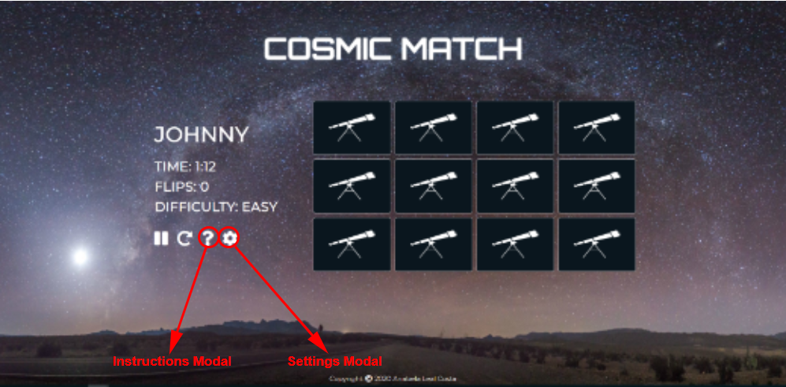

# Cosmic Match

Memory games are an entertaining way to improve one's memory, concentration, and attention to detail. Even though it can be as beneficial to small children as to adults, most games are designed for children. 

That's when **Cosmic Match** comes into play. It's a simple memory game that uses star constellations as images to be matched and provides an overall nice feel to the game. Using real star constellation might further enable the player to recognize star constellations in the night sky in real life.

The player is presented with 12 cards turned on their back. When the player clicks on the card, it's front is displayed, which should be memorized by the user to find the matching pairs. Each turn two cards are flipped and either matched or turned back for another try. Goal of the game is to match all cards before the time runs out. 

Cosmic Match - Live website

## Table of Content

1. User Experience (UX) 
    - Goals
        - [User](#user)
        - [Developer](#developer)
    - [User Stories](#user-stories)
    - Design Choices
        - [Layout](#layout)
        - [Colour scheme](#colour-scheme)
        - [Images](#images)
        - [Typography](#typography) 
        - [Icons](#icons)
    - [Accessibility](#accessibility)
    - [Navigation](#navigation)
    - [Wireframes](#wireframes)
1. Features 
    - [Existing features](#existing-features)
    - [Future considerations](#future-considerations)
1. Technologies used
    - [Languages](#languages)
    - [Libraries](#libraries)
    - [Tools](#tools)
1. [Testing](#testing) 
1. Bugs 
    - [Fixed bugs](#fixed-bugs)
    - [Existing bugs](#existing-bugs)
1. Deployment
    - [Deploy project](#deploy-project)
    - [Deployed vs development version](#deployed-vs-development-version)
    - [Run code locally](#run-code-locally)
1. Credits
    - [Media](#media)
    - [Code](#code) 
    - [Acknowledgments](#acknowledgments)
1. [Disclaimer](#disclaimer)
 
## User Experience (UX)

Generally, Cosmic Match intends to provide a seamless user experience by remembering the users' name and preferences as well as by including different features that enhance the gaming experience. 

Furthermore, it rounds off with his responsive and pleasing design, which is adequate for the targeted audience as well as the overall topic of the website. 

### Goals

#### User

Cosmic match targets the following audience: 
- English speaking
- Age can generally range, although the youngest users are expected to be teenagers
- Diverse audience *(gender, social status, nationality)*, but generally in private/free time
- Slight to strong interest in astrology

User goals: 
- Is looking for entertainment/a time waster 
- Wants to play a simple game with little time commitment
- Wants to play a game that is adequate for his age
- *Possibly looking specifically for a memory game to improve memory and concentration*

Cosmic Match fits these goals as it provides a simple memory game with an adequate design for the users' age. Furthermore, the time commitment to play Cosmic Match is very little as it can be started as soon as the name and difficulty preference have been submitted. For users that come back, this initial step is further condensed as it remembers the users' preferences. Additionally, each round is very short, with the longest taking 1min 15s. 

#### Developer

Developer goals: 
- Create a user friendly and intuitive memory game
- Learn how to write JavaScript to create and combine different functionalities into one consistent project
- Learn how to debug JavaScript effectively
- Write defensive code to ensure that unexpected actions from users don't have a negative effect on the website and overall user experience

### User Stories

- **User 1** ... is a first time-visitor of Cosmic Match
    - I want to be able to quickly start playing without having to create an account
    - I want to be able to choose a difficulty that seems adequate for my first try
    - I want to be able to review instructions on how to play the game
    - I want to be able to pause the game if an external distraction occurs
    - I want to be able to restart the game if I messed up (without having to wait until the time runs up)
    - I want to be able to change my difficulty settings in case I noticed it's too easy/too hard (without having to complete the game)
    - I want to be able to change my name in case it has a typo (without having to complete the game)
    - I want to notice easily when the time runs up
    - I want to have an overview of the current game like difficulty, time and flips without those details being too distracting
    - I want to have appropriate feedback when losing or winning the game 
    - I want to be able to play again if I liked the game

- **User 2** ... played Cosmic Match before
    - I want to be able to quickly start playing without having to enter all my details again
    - I want to be able to pause the game if an external distraction occurs
    - I want to be able to restart the game if I messed up (without having to wait until the time runs up)
    - I want to notice easily when the time runs up
    - I want to have an overview of the current game like difficulty, time and flips without those details being too distracting
    - I want to have appropriate feedback when losing or winning the game 
    - I want to be able to play again if I want

- **User 3** ... saw a friend play Cosmic Match and wants to give it a try himself
    - I want to be able to easily change the name to my own
    - I want to be able to choose a difficulty that seems adequate for my first try
    - I want to be able to review instructions on how to play the game
    - I want to be able to pause the game if an external distraction occurs
    - I want to be able to restart the game if I messed up (without having to wait until the time runs up)
    - I want to be able to change my difficulty settings in case I noticed it's too easy/ to hard (without having to complete the game)
    - I want to be able to change my name in case it has a typo (without having to complete the game)
    - I want to notice easily when the time runs up
    - I want to have an overview of the current game like difficulty, time and flips without those details being too distracting
    - I want to have appropriate feedback when losing or winning the game 
    - I want to be able to play again if I liked the game

### Design Choices

#### Layout

The whole website is visible on the users' screen which ensures that he doesn't have to scroll at any time. This has also been considered when deciding the number of cards as 12 cards can be displayed clearly across all devices while keeping the website on the users' viewport. Like this, all cards, icons and game details are in the users' field of view and are accessible at any moment during the game. 

Last but not least, the layout changes depending on the device size to ensure readability and ease of use. The additional icons also come into play on smaller devices to ensure that the website isn't too busy. 

#### Colour scheme

My colour choices were made with consideration of the background image. 

All the text elements as well as icons are white to provide clear contrast and ensure readability. The gradient colours for the glowing effect were selected in the colour picker in Chrome's DevTools by eye to ensure a visually appealing effect. This was used to additionally highlight specific text elements.

I've selected a dark blue (rgb(10, 22, 30)) for the background of the cards and modals as it fits with the overall background image while still contrasting well. Furthermore, white borders have been used for the cards by default to provide crisp and clear separation. The off-white rgb(248, 249, 250) as border and border shadow has additionally been used to distinguish selected cards from others. The same effect has been used for the modals at it highlights the modal from the faded out background and looks overall visually appealing. This has also been used when hovering over the buttons in the modals to provide the user with immediate feedback that this button is clickable. 

For the last seconds on each round, I've selected rgb(255, 122, 122). It's a soft shade of red that clearly signalizes that the time runs up and fits with the colours of the background image. It, nevertheless, is contrasting to the background and gets the users' attention with ease. 

#### Images

The background image plays a central role as it sets the overall atmosphere of the page. Therefore, several crops of the same image have been made to ensure high quality and good positioning across all devices.

The cards have vectors of star constellations as their front face while their back has a vector of a simple telescope. All selections have been made to fit the topic of Cosmic Match. 

#### Typography

The font **Orbitron** is a geometric sans-serif typeface that has a "spacey" touch to it. It was used for the website's name "Cosmic Match" to give it a brand-like look, which fits the overall topic perfectly. 

The font **Montserrat** was one of the popular pairings with Orbitron suggested by Google fonts. I chose to use this font as it's a very clean font, which gives additional effect to Orbitron. It has been used for all the other text on the website.  

#### Icons 

Icons were used for the action items on the website: pause/resume, restart, instructions, and settings. Their meaning is obvious as commonly used on websites/applications, which allows the user to immediately understand his options without needing to read through any text. Especially since the user is playing a game, this allows him to act quickly without being too distracted. 

Additionally, icons were used for the game details (time, flips, and difficulty level) on mobile devices to give additional space and make the website less busy for the user. 

Last but not least, a trophy icon was used in the congratulations modal to provide the user with a feeling of achievement. 

### Accessibility

The accessibility of websites is an important factor when planning and creating a project. To ensure accessibility, the following points have been implemented:

* **Images:** To ensure that any images provided give additional context to the user, the alt attribute has always been included with a short image description. 
* **Icons:** As icons were not used for decorative purposes but to provide the user with additional information (time, flips and difficulty level on mobile devices) or functionality (pause/resume, restart, open instructions, and change settings), additional information is provided to screen readers only. 

### Navigation

The navigation between the game itself and different modals is mainly controlled by the developer. 

There are two modals, that will show on page load. When the user accesses the website, the JavaScript code checks if he's a first-time user by checking if a player's name has been saved in a previous session. 

If any data can be found, the modal "Repeat start page" is displaying. 

 

Should no data be found, the modal "First start page" will show instead. 

 

Once the user sees the main page with the game, he can access the instructions and settings modal through the respective icons. Please see below: 

Two further modals are triggered by the JavaScript code: Game over and Congratulations. 

Should the time run out before the user finds all matching pairs, the Game over modal will show.

If the user finds all matching pairs, the Congratulations modal will display. 

All buttons of the modals, bring the user back to the main page with the memory game. 

### Wireframes

The following wireframes were created using [Balsamiq](https://balsamiq.com/?gclid=CjwKCAjwh472BRAGEiwAvHVfGsly1Nt9bDZCFUTGCc9I8OfaLtSIcxLhm_WX8911ERsm__luBJslTBoCqgQQAvD_BwE) during the design and planning process for this project. They have not been amended since the repository has been created and, therefore, display small differences when compared to the live website.

* [First start page](assets/wireframes/first-start-page.pdf)
* [Memory game](assets/wireframes/memory-game.pdf)
* [Modal - Instructions](assets/wireframes/instructions.pdf)
* [Modal - Game won](assets/wireframes/game-won.pdf)
* [Modal - Game over](assets/wireframes/game-over.pdf)

While writing code, two further modals were added as they would provide an improved user experience. Their wireframes have been created at a later moment. 

* [Repeat start page](assets/wireframes/repeat-start-page.pdf)
* [Modal - Settings](assets/wireframes/settings.pdf)

## Features
 
### Existing Features

- **Functionality executed on page load**
    - When the user loads the page, the code checks if there's a player name stored from a previous session. 
        * No player name is found: first start page modal is displayed and the default difficulty level easy is set.
        * Previous player details are found: display repeat start page modal, update the player name and difficulty button selected in modal, update player name and difficulty in main page. 

- **First start page modal**
    - When arriving at the page for the first time, this modal pops up to collect the players' name and gives him the option to select the desired difficulty level. Please note that the difficulty easy is selected by default. 
    - The input of the player name is required and limited to 10 characters to allow it to be displayed neatly across all devices. 
    - The active/clicked button has distinct styling to clearly indicate to the user which difficulty has been selected. Choosing a different difficulty will simply remove this styling from this button and add it to the newly selected one. 
    - The play now button changes his styling on hover to indicate that it's clickable to the user. 
    - The modal has been programmed to only close when clicking on the "Play now" button - not when clicking outside the modal or pressing enter after typing in the name. This is to ensure that all details have been given and that the needed functionality to set up the game is executed. 
    - Functionality executed upon pressing "Play now": 
        * Store player name and difficulty selected
        * Depending on difficulty selected: adapt time limit, display difficulty and select cards used
        * Shuffle cards and start timer

 

- **Repeat start page modal**
    - For any subsequent times that the user visits this website, this modal pops up. It has text that indicates that Cosmic Match is aware that it has already been played by the user. Additionally, the modal displays the players' name and difficulty preference from their last session. 
    - The user has the option to change the difficulty. The active/clicked button has distinct styling, which changes if another difficulty is selected.
    - The user can also change the player name by clicking on the link *"You're not [player name]?"*. Upon clicking, a field for the name input opens, which allows the user to update his current player name. Updating the name is optional and limited to 10 characters. Please note that the player name will only be updated if this field isn't empty. 
    - The modal has been programmed to only close when clicking on the "Play now" button - not when clicking outside the modal or pressing enter after typing in the name. This is to ensure that the needed functionality to set up the game is executed. 
    - The play now button changes his styling on hover to indicate that it's clickable to the user. 
    - Functionality executed upon pressing "Play now": 
        * Depending on difficulty selected: adapt time limit, display difficulty and select cards used
        * Check if new player name has been provided and update it accordingly
        * Shuffle cards, start timer and reset flip counter

- **Main page**
    - The main page consists of 5 sections: Cosmic match title, player name, game details, action items, and the game board with the cards.
    - The player name updates according to the player's input to engage additionally in the game. 
    - The game details section displays the time the user has left, the flips made and the difficulty selected. It updates automatically to always inform the user of the current state of his game. 
    - The action items are displayed neatly as icons and allow the user to perform additional actions: pause/resume game, restart game, open instructions, and change settings. For all icons, the cursor has been added as a pointer to indicate their clickability.   

- **Game details**
    - **Timer:** The timer displays the time the user has left to complete the game. It is automatically updated depending on the selected difficulty level and is displayed in minutes and seconds. Additionally, it changes the font colour to a soft red when less than 10 seconds are left, to signalize to the user that the time is running up. 
    - **Flips Counter:** The flips counter increases each time the user flips a card and not upon clicking a card. This ensures that cards clicked twice in the same turn are only counted once. 
    - **Difficulty:** It displays the difficulty selected and updates should it be changed.

- **Pause/resume**
    - When clicking on the pause icon, the timer is paused and the event listener is removed from the cards to prevent the user from playing. 
    - Additionally, the pause icon is hidden and the resume icon is displayed instead, to provide the user with the option to continue the game. 
    - When the resume icon is clicked, the timer continues where left off and the cards can be clicked again. At the same time, this icon is exchanged with the original pause icon to bring this functionality to full circle. 

- **Restart**
    - The restart functionality allows the user to restart the current game.
    - Functionality executed once clicked:
        - Flips counter is reset
        - Time is set back to original time-limit (depending on difficulty) and if applied, the red styling for the last seconds is removed. 
        - If the game was paused previously and the user had the option to resume the game, this is replaced by the pause icon and it's functionality.
        - All cards are flipped back and shuffled. Please note that a time out function has been used to ensure that the cards are only shuffled when all cards are fully flipped back. Furthermore, the cards cannot be clicked until those steps are completed to prevent any issues. 

### Future considerations

- **Adding audio to enhance UX**
    - The website should be enhanced with audio effects in the future as this would improve the overall user experience and engage the user more in the game.
    - Appropriate sound effects should be used when clicking on the cards, matching pairs and losing or winning the game. 
    - The sound will be turned on by default, but the user should be presented with an option to toggle it on/off as to his own preference. 
- **Add scoring system**
    - By implementing a scoring system, the user will be more engaged in the game as he tries to improve his personal score. 
    - Both - time and card flips - will be taken into consideration for the score. Matching cards at an earlier stage will score higher points. Furthermore points for the remaining time will be added, as points for the card flips subtracted.
    - The user will further be presented with his personal highscore which will display on the game dashboard and update automatically should he improve himself. 
- **Provide additional information about star constellations**
    - While the player is matching the cards he might ask himself which star constellations he's currently looking at. 
    - The user should have the ability to get more details about each of the star constellation through an magnifying icon in the action items section. Once clicked, it will open a modal that contains the image of each star constellation used, it's name and additional fun facts like e.g. it's overall size. 
    - This will round up the experience for the user and prevent him to leave the website to do some research himself. 

## Technologies Used

### Languages
This project uses **HTML**, **CSS** and **JavaScript**. 

### Libraries
- [Bootstrap](https://getbootstrap.com/): Its grid, components and classes simplify the website structure and add additional responsiveness. 
- [jQuery](https://jquery.com/): This JavaScript library simplifies DOM manipulation.
- [Favicon.io](https://favicon.io/): Provides favicons to improve website recognition and branding.
- [Font Awesome](https://fontawesome.com/): Provides icons to simplify and visualise content and creates a better UX.
- [Google Fonts](https://fonts.google.com/): Used to style the website font.

### Tools

- [Github](https://github.com/): Hosts the project files and was used to deploy the website to Git Pages. Additionally the Githubs Projects Planner was used to plan the project and keep track of any outstanding tasks (see [here](https://github.com/AnabelaLealCosta19/cosmic-match/projects/1)).
- [Gitpod](https://www.gitpod.io/): Provides a developing environment to write code and commit changes to Github.
- [Git](https://git-scm.com/): Used for version control of the project.
- [Balsamiq](https://balsamiq.com/?gclid=CjwKCAjwh472BRAGEiwAvHVfGsly1Nt9bDZCFUTGCc9I8OfaLtSIcxLhm_WX8911ERsm__luBJslTBoCqgQQAvD_BwE): Used in the surface plane (UXD) to plan my project and create wireframes.
- [Paint 3D](https://www.microsoft.com/en-us/p/paint-3d/9nblggh5fv99?activetab=pivot:overviewtab): Used to crop background image for each device type devices and to remove star constellations names from cards. 
- [Snipping Tool](https://en.wikipedia.org/wiki/Snipping_Tool): Used to make screenshots and to compare different styles side by side.
- [Chrome DevTools](https://developers.google.com/web/tools/chrome-devtools): Allows styling withing Chrome browser and provides valuable insights when troubleshooting.
- [Unicorn Revealer](https://chrome.google.com/webstore/detail/unicorn-revealer/lmlkphhdlngaicolpmaakfmhplagoaln): Changes styling of website to black and pink to show borders and simplify debugging of overflow. 
- [WhatIsMyScreenResolution](http://whatismyscreenresolution.net/): Determines the screen resolution of your current device (this information helps when troubleshooting with developer tools).
- [Nu HTML Checker](https://validator.w3.org/nu/): Validated my HTML code.
- [W3C CSS Validator](https://jigsaw.w3.org/css-validator/): Validate my CSS code.
- [Esprima](https://esprima.org/demo/validate.html): Validate my JS code.
- [Diffchecker](https://www.diffchecker.com/): Used to identify mistakes by comparing similar elements of my website (working vs not working).
- [FREEFORMATTER](https://www.freeformatter.com/): Indented my HTML, CSS and JS code.
- [LetterCount](https://www.lettercount.com/): Counted letters of commit messages to ensure they aren't too long.
- [Scribens.com](https://www.scribens.com/): Checked grammar of website and readme content.
- [Am I Responsive](http://ami.responsivedesign.is/): Used to display website across devices for screenshot in product introduction.
- [Diagram Editor](https://www.diagrameditor.com/): Used to create the diagrams for my readme.

## Testing !!!

In this section, you need to convince the assessor that you have conducted enough testing to legitimately believe that the site works well. Essentially, in this part you will want to go over all of your user stories from the UX section and ensure that they all work as intended, with the project providing an easy and straightforward way for the users to achieve their goals.

Whenever it is feasible, prefer to automate your tests, and if you've done so, provide a brief explanation of your approach, link to the test file(s) and explain how to run them.

For any scenarios that have not been automated, test the user stories manually and provide as much detail as is relevant. A particularly useful form for describing your testing process is via scenarios, such as:

1. Contact form:
    1. Go to the "Contact Us" page
    2. Try to submit the empty form and verify that an error message about the required fields appears
    3. Try to submit the form with an invalid email address and verify that a relevant error message appears
    4. Try to submit the form with all inputs valid and verify that a success message appears.

In addition, you should mention in this section how your project looks and works on different browsers and screen sizes.

You should also mention in this section any interesting bugs or problems you discovered during your testing, even if you haven't addressed them yet.

If this section grows too long, you may want to split it off into a separate file and link to it from here.

## Bugs

### Fixed bugs !!!

### Existing bugs !!!

## Deployment

### Deploy project

My project has been deployed to GitHub Pages. To do so, I completed the steps below:

1. Navigated to my repository "cosmic-match"
2. Clicked on **Settings**
3. Under **GitHub Pages**, I used the **Source** drop-down menu and selected "master branch"
4. Clicked on **Save**

Once done, GitHub displayed the following message: "Your site is published at https://anabelalealcosta19.github.io/cosmic-match/". I clicked on the link and could confirm that the website was successfully deployed. 

### Deployed vs development version

My Github Pages site is built from the master brand. All changes have been saved, committed and pushed. Therefore, there should be no differences between the deployed and the development version.  

### Run code locally

To run code locally, the remote Github repository needs to be cloned. Cloning a repository pulls down a full copy of all the repository data that GitHub has at that point, including every file and folder of the project. Changes can be pushed to the remote Github repository at any time.

Find below the necessary steps to be able to run the code locally. The default instructions relate to Windows, any differences for Mac and Linux have been added in brackets. 

#### Cloning a repository using the command line
1. On GitHub, navigate to the main page of the repository.
1. Under the repository name, click **Clone or download**.
1. **Clone with HTTPS**: Click on the clipboard symbol beside the web URL to clone the repository using HTTPS. To clone using a SSH key (or certificate issued by the SSH certificate authority), click **Use SSH** and then the clipboard symbol.
1. Open Git Bash [*Mac & Linux: Open Terminal*].
1. Change the current working directory to the location you want the cloned directory. 
1. Type **git clone** and paste the URL you copied in step 3.
1. Press enter to create the local clone.

#### Cloning a repository to GitHub Desktop
1. Sign in to GitHub and GitHub Desktop before you start to clone.
1. On GitHub, navigate to the main page of the repository.
1. Under the repository name, click **Clone or download**.
1. **Clone with HTTPS**: Click on **Open in Desktop** to clone the repository and open it in GitHub Desktop.
1. Click **"Choose..."** and navigate to a local path where you want to clone the repository.
1. Click **Clone** to create the local clone.

## Credits

### Media

I exclusively used images as media for my website. 

The images used in this project have been obtained from the following sources:

* **Background image:** Free image downloaded from [pxhere](https://pxhere.com/en/photo/115088). To view the image click [here](https://pxhere.com/en/photo/115088).
* **Card images - front:** Vector images purchased at [Creative market](https://creativemarket.com/). To view the specific product click [here](https://creativemarket.com/skyboxcreative/448990-Constellations-Vector-Set#fullscreen).
* **Card images - back:** Telescope vector obtained from [shutterstock](https://www.shutterstock.com/home). To view the image click [here](https://www.shutterstock.com/image-vector/telescope-flat-icon-on-black-background-599913728).

### Code

Code has been used by me from the following sources: 

Language | Effect | Example | Source | URL
-------- | ------ | ------- | ------ | ---
CSS | Vertically align block-level element with unknown height | style.css, lines 34-45 | [CSS tricks](https://css-tricks.com/) | [here](https://css-tricks.com/centering-css-complete-guide/)
CSS | Styling: glowing text | style.css, lines 55-58 | [Free Frontend](https://freefrontend.com/) | [here](https://freefrontend.com/css-glow-text-effects/)
CSS | Flip cards | style.css, lines 204-219 | [FreeCodeCamp (youtube channel)](https://www.youtube.com/channel/UC8butISFwT-Wl7EV0hUK0BQ) | [here](https://www.youtube.com/watch?v=ZniVgo8U7ek&t=298s)
CSS | Combine several conditions in same media query | style.css, lines 283-303 | [MDN web docs](https://developer.mozilla.org/en-US/) | [here](https://developer.mozilla.org/en-US/docs/Web/CSS/Media_Queries/Using_media_queries)
JS | Disable enter key | game.js, lines 78-82 | [Paulund](https://paulund.co.uk/) | [here](https://paulund.co.uk/how-to-disable-enter-key-on-forms)
JS | Shuffle cards | game.js, lines 93-99 | [FreeCodeCamp (youtube channel)](https://www.youtube.com/channel/UC8butISFwT-Wl7EV0hUK0BQ) | [here](https://www.youtube.com/watch?v=ZniVgo8U7ek&t=298s)
JS | Define if card if first or second card | game.js, lines 234-253 | [FreeCodeCamp (youtube channel)](https://www.youtube.com/channel/UC8butISFwT-Wl7EV0hUK0BQ) | [here](https://www.youtube.com/watch?v=ZniVgo8U7ek&t=298s)
JS | Remove last character from id | game.js, lines 268-270 | [Stackoverflow](https://stackoverflow.com/) | [here](https://stackoverflow.com/questions/1794822/remove-last-character-in-id-attribute)
JS | Check if all elements in array have specific class | game.js, lines 297-301 | [Stackoverflow](https://stackoverflow.com/) | [here](https://stackoverflow.com/questions/31962074/jquery-how-to-check-if-all-element-in-array-have-specific-class)
   
### Acknowledgments

While I  decided to create a memory game, I got the inspiration for the overall theme from my partner Glen Harris. He has always been truly fascinated by astronomy and stars in particular. When looking at the different constellations at night, I had the idea to combine this with my second project. 

## Disclaimer

This website has been created for educational purposes only.